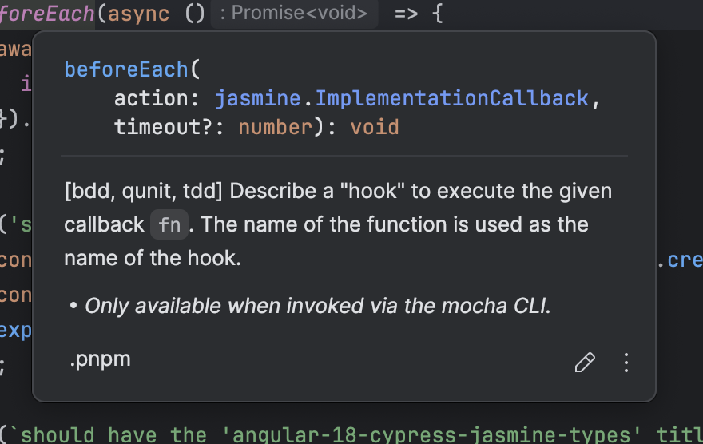

# Angular18CypressJasmineTypes

This is a minimal reproduction for [an issue](https://youtrack.jetbrains.com/issue/WEB-68686) in JetBrains IDEs. TL;DR: IDE thinks unit tests are Chai/Mocha tests but they're Jasmine ones. Probably because confusing them with Cypress tests instead. Therefore unit test assertions (i.e.: `toBeTruthy`) appear in red color as the definitions aren't found. Though they actually work (like when running them with `ng test`)

## UPDATE: Refer to `app/spec` Typescript configs

After [reply from a JetBrains team member](https://youtrack.jetbrains.com/issue/WEB-68998/Paths-from-tsconfig.app.json-are-ignored#focus=Comments-27-10762562.0-0), the suggested fix is to refer to `tsconfig.app/spec.json` from `tsconfig.json` 

This has been applied in [commit `24f929b`](https://github.com/davidlj95/angular-18-cypress-jasmine-types/commit/24f929b1da27a88d2c623c2c99c55e0c8961d555)

After that, when using WebStorm 2024.2.3 seems the issue about assertion types is fixed.

Though the docs / "Go to declaration" of `beforeEach`, `describe`, `it` and `expect` are wrong.
When using <key>Cmd</key> + <key>B</key> and <key>F1</key> to see docs, Mocha/Chai docs appear:



Mocha ones appear for `beforeEach`, `describe` and `it`. Chai ones for `expect`.

When using "Go to declaration or usages" you go to `(chai|mocha)/index.d.ts`

## Creating the repository
To create the repository, a fresh Angular app has been created with the following command:

```shell
pnpm dlx @angular/cli new \
  --package-manager=pnpm \
  angular-18-cypress-jasmine-types
```

Choosing defaults: CSS + no SSR/SSG. Using `pnpm` for `p`erformance purposes.

## Reproducing the issue

The issue isn't be there when cloning the repo. However, switch into one of the two branches:

- [`root-schematic`](https://github.com/davidlj95/angular-18-cypress-jasmine-types/tree/root-schematic). Where Cypress has been added via [Cypress Angular Schematic](https://www.npmjs.com/package/@cypress/schematic)
- [`root-manual`](https://github.com/davidlj95/angular-18-cypress-jasmine-types/tree/root-manual). Where Cypress has been added manually by `pnpm install -DE cypress`

For instance, `git checkout root-manual`. Then run `pnpm install`. Open the example unit test file `app.component.spec.ts`. The issue appears. `toBeTruthy` appears in red color. Amongst the rest of assertions too.

### Extra notes
When switching back to `main` branch to write this note in `README.md` the issue disappeared. Switching to a branch where Cypress has been added, raises the issue back again. 

Notice some time must pass for the red color to appear. What is instant is that hovering over `toBeTruthy` or other assertions triggers a popup saying that there are no definitions available. When if in `main` branch where no Cypress exists, hovering over the assertion triggers a popup with Jasmine's documentation

Turned off `Test Automation` plugin just in case. Restored default settings just incase. Invalidated caches too.

> Now `Test Automation` plugin is reporting an issue about OpenAPI when enabling it back. Will create a separate issue for that too.

This project was generated with [Angular CLI](https://github.com/angular/angular-cli) version 18.2.5.

## Development server

Run `ng serve` for a dev server. Navigate to `http://localhost:4200/`. The application will automatically reload if you change any of the source files.

## Code scaffolding

Run `ng generate component component-name` to generate a new component. You can also use `ng generate directive|pipe|service|class|guard|interface|enum|module`.

## Build

Run `ng build` to build the project. The build artifacts will be stored in the `dist/` directory.

## Running unit tests

Run `ng test` to execute the unit tests via [Karma](https://karma-runner.github.io).

## Running end-to-end tests

Run `ng e2e` to execute the end-to-end tests via a platform of your choice. To use this command, you need to first add a package that implements end-to-end testing capabilities.

## Further help

To get more help on the Angular CLI use `ng help` or go check out the [Angular CLI Overview and Command Reference](https://angular.dev/tools/cli) page.
